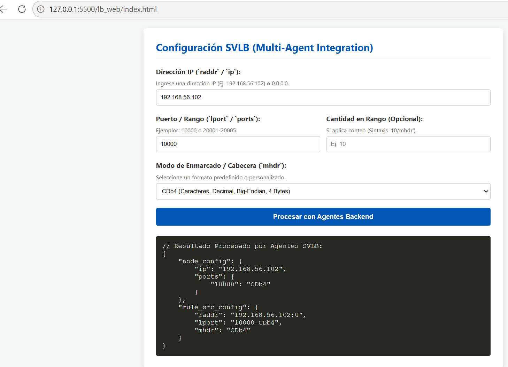

# Load Balancer Automation Builder (LB Automation Builder) 🚀


-red.svg)

**LB Automation Builder** es un sistema orquestado por una **arquitectura multiagente distribuida** sobre **LangGraph** diseñada para automatizar el ciclo de vida de administración, configuración, validación y documentación de reglas para **SmartVista Load Balancer**.

El sistema procesa requerimientos operativos expresados en lenguaje natural o especificaciones parciales, los convierte en objetos JSON validados, genera documentación técnica en formato Markdown y simula/ejecuta la subida de paquetes de configuración a contenedores de **Oracle Cloud Infrastructure (OCI)**.

---

## 📄 Tabla de Contenidos

- [Arquitectura del Sistema](#-arquitectura-del-sistema)
- [Flujo de Trabajo (Workflow)](#-flujo-de-trabajo-workflow)
- [Estructura de Agentes](#-estructura-de-agentes)
- [Esquema de Datos y Validación](#-esquema-de-datos-y-validación)
- [Requisitos Previos](#-requisitos-previos)
- [Instalación y Configuración](#-instalación-y-configuración)
- [Ejecución](#-ejecución)
- [Estructura del Proyecto](#-estructura-del-proyecto)

---

## 🏗 Arquitectura del Sistema

El proyecto sustituye los flujos secuenciales rígidos por un **grafo determinista con agentes especializados**. La comunicación entre nodos se realiza a través de un estado global compartido (`LBAutomationState`), donde un **Supervising Router** evalúa continuamente la condición de la configuración para enrutar la ejecución hacia el agente más adecuado.


```

```
              +-----------------------+
              |      START / USER     |
              +-----------+-----------+
                          |
                          v
                  +---------------+
                  | Router Node   |<-----------------------+
                  +-------+-------+                        |
                          |                                |
    +---------------------+---------------------+            |
    |             |               |             |            |
    v             v               v             v            |

```

+-----------+ +-----------+   +-----------+ +-----------+      |
|  Ingress  | |Constructor|   | Validator | | Documenter|      |
|   Agent   | |   Agent   |   | & Repairer| |   Agent   |      |
+-----+-----+ +-----+-----+   +-----+-----+ +-----+-----+      |
|             |               |             |            |
+-------------+---------------+-------------+------------+
| (Validación OK + Doc lista)
v
+---------------+
|  Supervisor   |
+-------+-------+
|
v
+-----+
| END |
+-----+

```

---

## 🔄 Flujo de Trabajo (Workflow)

1. **Ingreso (Ingress):** El usuario ingresa una solicitud de balanceo en lenguaje natural.
2. **Interpretación:** El **Ingress Agent** traduce la solicitud a parámetros técnicos clave.
3. **Generación:** El **Constructor Agent** arma el bloque de código JSON de acuerdo al estándar de SmartVista.
4. **Validación y Autorreparación:** El **Validator Agent** evalúa la sintaxis mediante esquemas Pydantic. Si se identifican errores, activa el sub-ciclo de reparación.
5. **Documentación & Cloud:** El **Documenter Agent** crea la ficha técnica en Markdown y emite los enlaces de repositorio en OCI Object Storage.
6. **Consolidación:** El **Supervisor** presenta el reporte final integrado.

---

## 🤖 Estructura de Agentes

| Agente / Nodo | Función Principal | Salida Producida |
| :--- | :--- | :--- |
| **Router Node** | Evalúa el estado del grafo y toma la decisión determinista de enrutamiento mediante un esquema de Pydantic. | `next_node` ("ingress", "constructor", "validator", "documenter", "supervisor") |
| **Ingress Agent** | Extrae requerimientos técnicos (puerto, protocolo, algoritmo, backends) a partir de lenguaje natural. | `raw_requirements` |
| **Constructor Agent** | Genera la definición estructural de la regla en JSON compatible con SmartVista. | `generated_json_config` |
| **Validator Agent (Repairer)** | Valida estricta y sintácticamente el JSON generado contra el esquema Pydantic `SmartVistaLBRule`. Repara el JSON en caso de error. | `validation_status` (Boolean), `validation_errors` |
| **Documenter Agent** | Redacta la ficha técnica y coordina las llamadas a herramientas externas (OCI Object Storage API). | `final_documentation`, `oci_object_link` |
| **Supervisor Node** | Redacta la respuesta y despliega la consola/resumen final para el usuario. | `messages` (Markdown + JSON + Enlaces) |

---

## 🛡 Esquema de Datos y Validación

Toda configuración generada debe ser compatible con la estructura base de **SmartVista Load Balancer**.

```python
class SmartVistaLBRule(BaseModel):
    rule_name: str = Field(description="Nombre único de la regla de balanceo.")
    listen_port: int = Field(description="Puerto de escucha (ej. 8088).")
    protocol: Literal["TCP", "HTTP", "HTTPS", "ISO8583"] = Field(description="Protocolo de red.")
    algorithm: Literal["ROUND_ROBIN", "LEAST_CONNECTIONS", "IP_HASH"] = Field(description="Algoritmo de distribución.")
    backend_servers: List[str] = Field(description="Direcciones IP:Puerto de los servidores destino.")
    health_check_endpoint: Optional[str] = Field(default="/health", description="Ruta de comprobación de estado.")
    timeout_ms: int = Field(default=5000, description="Tiempo límite de respuesta en ms.")

```

---

## 🛠 Requisitos Previos

* **Python:** 3.10 o superior.
* **OpenAI API Key:** Acceso a modelos GPT-4o o equivalentes.
* **Librerías Clave:**
* `langgraph`
* `langchain-core`
* `langchain-openai`
* `pydantic`


---

## 📦 Instalación y Configuración

1. **Clonar el repositorio:**
```bash
git clone [https://github.com/ihernandez-cripto/lb-automation-builder.git](https://github.com/ihernandez-cripto/lb-automation-builder.git)
cd lb-automation-builder

```


2. **Crear y activar un entorno virtual:**
```bash
python -m venv venv
source venv/bin/activate  # En Linux/macOS
# venv\Scripts\activate   # En Windows

```


3. **Instalar dependencias:**
```bash
pip install -r requirements.txt

```


4. **Configurar variables de entorno:**
Crea un archivo `.env` en la raíz del proyecto:
```env
OPENAI_API_KEY="tu-api-key-aqui"
OCI_COMPARTMENT_ID="ocid1.compartment.oc1.."  # Opcional para despliegue OCI real

```


---

## 🚀 Ejecución

Puedes ejecutar el motor de la aplicación ejecutando el script principal:

```bash
python main.py

```

### Ejemplo de Prompt de Entrada:

> "Necesito balancear el tráfico transaccional ISO8583 en el puerto 8088. Usa el algoritmo LEAST_CONNECTIONS y los backends 10.0.1.15:8088 y 10.0.1.16:8088. El endpoint de healthcheck es /check."

---

## 📂 Estructura del Proyecto

```text
lb-automation-builder/
├── config/
│   └── settings.py             # Configuración general de variables y claves API
├── schemas/
│   ├── lb_schema.py            # Esquema Pydantic SmartVistaLBRule
│   └── router_schema.py        # Esquema de decisión para RouterDecision
├── nodes/
│   ├── router.py               # Lógica del nodo enrutador
│   ├── agents.py               # Nodos de los agentes (Ingress, Constructor, Validator, Documenter)
│   └── supervisor.py           # Nodo final de consolidación
├── tools/
│   └── oci_tools.py            # Herramientas de integración con Oracle Cloud Infrastructure
├── graph.py                    # Ensamble de nodos y bordes condicionales en LangGraph
├── main.py                     # Punto de entrada para ejecución por CLI
├── requirements.txt            # Dependencias del proyecto
└── README.md                   # Documentación del proyecto

```

---

## 🤝 Contribuciones

Las contribuciones son bienvenidas. Para cambios mayores, abre un *issue* primero para discutir lo que te gustaría modificar o mejorar.

---

## 📝 Licencia

Este proyecto está distribuido bajo la licencia MIT. Consulta el archivo `LICENSE` para más detalles.

```

```
